# SV-ONT-Tibetan
This repository includes data and scripts to analyze structural variations of 25 Chinese samples using nanopore sequencing. 

## Citing information
If you use the methods or pipeline in this repository, please cite our paper.
Also, you can get detailed information about these methods in the supplementary method of our paper.

Quan, C., Li, Y., Liu, X. et al. Characterization of structural variation in Tibetans reveals new evidence of high-altitude adaptation and introgression. Genome Biol 22, 159 (2021). https://doi.org/10.1186/s13059-021-02382-3


## Summary of SV callsets

| Description      | Format  | Location                                                                                                                          |
|------------------|---------|-----------------------------------------------------------------------------------------------------------------------------------|
| SV callsets      | vcf.gz  | example/merge.ont.genotyped.SURVIVOR.sorted.reheader.corrected.INDELtoSYMBOL.sorted.local.addINFO.addFST.addCIPOS.addCIEND.vcf.gz |
| SV genotypes     | vcf.gz  | example/merge.genotypes.corrected.delCHR.svtk.vcf.gz                                                                              |
| Sample list      | xlsx    | example/samples.xlsx                                                                                                              |
| SV annotation    | tsv.zip | example/merge.genotypes.corrected.delCHR.svtk.annotsv.public.tsv.zip                                                              |
| SV Distribution  | tsv     | example/merge.genotypes.corrected.delCHR.svtk.dist                                                                                |
| SV hom&het       | tsv     | example/merge.genotypes.corrected.delCHR.svtk.gte1ngs.LDpruned.het                                                                |
| Fixation index   | tsv     | example/merge.paragraph.genotypes.TIBvsHAN.20k_5k.windowed.weir.fst                                                               |
| Gene annotations | gtf.gz  | 0_raw_data/gencode.v32lift37.canonical_annotation.gtf.gz                                                                          |


## Pipeline for Multi-sample SV-calling and annotation

### Script: pipeline.sv-calling.sh

### Requirements
- [NGMLR](https://github.com/philres/ngmlr)
- [Sniffles](https://github.com/fritzsedlazeck/Sniffles)
- [SVIM](https://github.com/eldariont/svim)
- [NanoSV](https://github.com/mroosmalen/nanosv)
- [SURVIVOR](https://github.com/fritzsedlazeck/SURVIVOR)
- [SVTK](https://github.com/talkowski-lab/svtk)
- [ANNOTSV](https://github.com/lgmgeo/AnnotSV)
- [Paragraph](https://github.com/Illumina/paragraph)
- [vcftools](http://vcftools.sourceforge.net/man_latest.html)
- [bcftools](http://samtools.github.io/bcftools)
- python3
- numpy

### Summary
In the bash file ```pipeline.sv-calling.sh```, we use sample data to demonstrate the complete process of detecting and annotating structural variations based on nanopore sequencing technology.  

1. Firstly, long reads were mapped to GRCh37 human reference from NCBI without alternate sequences. Mapping was performed with NGMLR with ONT default parameters. 

2. Then SV calling was performed on each sample using Sniffles, NanoSV, and SVIM. These tools have been reported to be compatible with NGMLR and show better accuracy and sensitivity than others. Five minimum supporting reads with at least 50 bp length was required. The insertion sequence and read ID was required for each method, and the rest are all default parameters. 

3. SURVIVOR was used to merge the SVs per each sample, which are supported by at least two methods with a maximum allowed pairwise distance of 1,000 bp between breakpoints. Meanwhile, SVs obtained from different tools are not necessary to agree on the SV-type or the strand, so that we could capture as many potential breakpoints as possible. Finally, we merged the SVs obtained from all the samples as long as one sample supports it. 

4. At last, we need to get a fully genotyped multi-samples dataset. We re-ran Sniffles across all the samples with all these potential regions (--Ivcf) and finally combined SVs with SURVIVOR. This time, we asked SURVIVOR only to report SVs supported by at least one sample, and they have to agree on the SV-type. Furthermore, we used a hard threshold with five minimum supporting reads, and all non-missing genotypes less than this threshold were modified to reference. 

5. After SVs were discovered within a small population using long-read sequencing, we then genotyped these SVs with a relatively large amount of NGS data accumulated in previous studies. Paragraph, which is a new graph-based method, was used to genotype each NGS genome. We set the maximum allowed read count for SVs to 20 times the mean genome coverage for each dataset described above. We replaced all genotypes which failed to pass any filters by Paragraph with missing genotypes (./.).

6. We annotated SVs for a range of potential effects on coding sequences using SVTK and AnnotSV.


    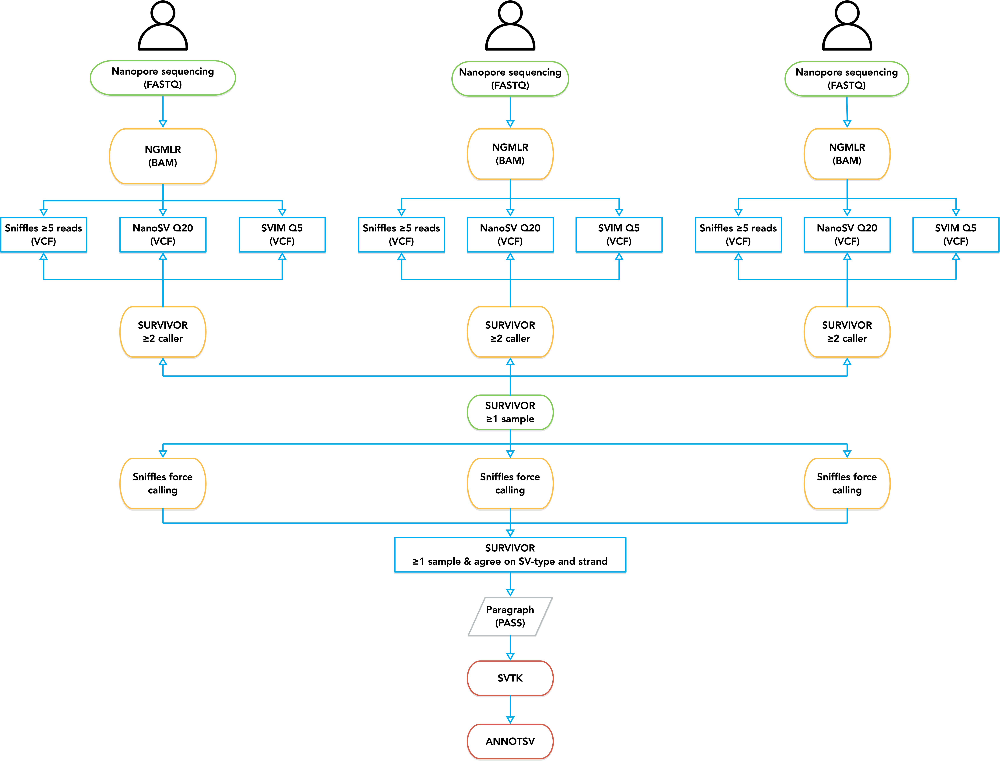


-------

## Pipeline for demographic inference and simulation

### Script: pipeline.demographic_inference.sh

### Other Requirements
- [easySFS](https://github.com/isaacovercast/easySFS)
- [∂a∂i](https://dadi.readthedocs.io/en/latest/)
- [msprime](https://github.com/tskit-dev/tutorials)


### Summary
In the bash file ```pipeline.demographic_inference.sh```, we performed demographic inference by easySFS and make whole-genome simulation by msprime.

1. Firstly, we used SNVs to estimate the demographic history of Tibetans and Hans. An unfolded joint site frequency spectrum (SFS) of non-genic autosomal bases was estimated using easySFS.

2. To explore the alternative demographic models for the population model YRI-TIB-HAN, we used the diffusion approximation method of ∂a∂i to analyze the joint SFS.

3. When the best-fit demographic model was recognized, we used msprime to perform whole-genome coalescent simulations. To approximately account for mutational heterogeneity across the genome, we applied a three-step framework described in a previous study (Hsieh PH, et al. 2019).

-------

## Pipeline for detection of introgression signals

### Script: pipeline.detection_introgression.sh

### Other Requirements
- [genomics_general](https://github.com/simonhmartin/genomics_general)

### Summary
In the bash file ```pipeline.detection_introgression.sh```, we applied the D-statistic and fd-statistic for each simualtion.

-------
## Visualization for chracteristics of SVs

### Script: pipeline.plot.R

### Examples: ###

* SV distribution

    ```R
    library(circlize)
    karyo_plot <- as.data.frame(data_sv_details_all_karyo)
    karyo_plot$SUPP <- as.integer(karyo_plot$SUPP)
        
    karyo_plot_BND <- karyo_plot[karyo_plot$SVTYPE=='TRA',]
    karyo_plot_BND$seqnames <- paste('chr',karyo_plot_BND$seqnames, sep = '')
    karyo_plot_BND_link <- karyo_plot_BND[,c('CHR2','END','END')]
    colnames(karyo_plot_BND_link) <- c('seqnames', 'start', 'end')
    karyo_plot_BND_link$seqnames <- paste('chr', as.character(karyo_plot_BND_link$seqnames), sep = "")
    karyo_plot_BND_link$start <- as.integer(karyo_plot_BND_link$start)
    karyo_plot_BND_link$end <- as.integer(karyo_plot_BND_link$end)
        
    array_seqnames <- paste('chr', karyo_plot$seqnames,sep = '')
        
    circos.initializeWithIdeogram(species = 'hg19')
        
    group_shared <- karyo_plot$SUPP==25
    group_major <- karyo_plot$SUPP%in%seq(13,24)
    group_polymorphic <- karyo_plot$SUPP%in%seq(2,12)
    group_singleton <- karyo_plot$SUPP==1
        
    circos.trackHist(factors=array_seqnames, 
                   track.height = 0.1,
                   x=karyo_plot$start,col = "#999999", border = '#999999', 
                   bg.border = NA, bin.size = 500000)
    circos.trackHist(factors=array_seqnames[group_shared], 
                   track.height = 0.1, 
                   x=karyo_plot[group_shared,]$start,col = "red", border = 'red', 
                   bg.border = NA,bin.size = 500000)
    circos.trackHist(factors=array_seqnames[group_major], track.height = 0.1, x=karyo_plot[group_major,]$start,col = "purple", border = "purple",bg.border = NA,bin.size = 500000)
    circos.trackHist(factors=array_seqnames[group_polymorphic], track.height = 0.1, x=karyo_plot[group_polymorphic,]$start,col = "blue",border = "blue",bg.border = NA,bin.size = 500000)
    circos.trackHist(factors=array_seqnames[group_singleton], track.height = 0.1, x=karyo_plot[group_singleton,]$start,col = "light blue",border = "light blue",bg.border = NA,bin.size = 500000)
    ```
    
    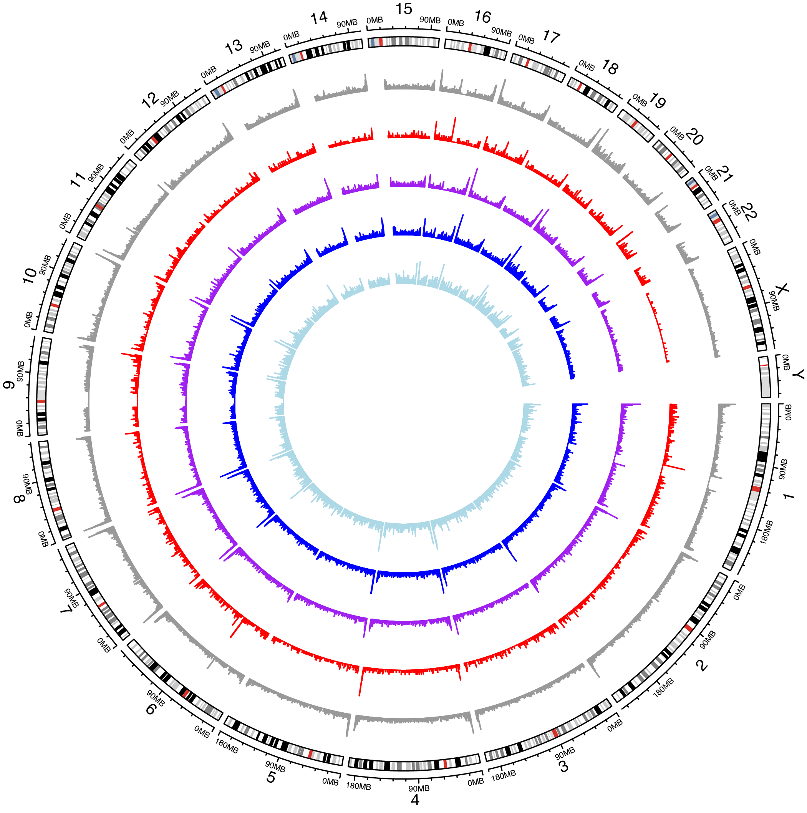
* Sample Distribution for NGS data
    ```R
    library(maps)
    library(mapdata)
    library(maptools);
    china_map=readShapePoly('china-province-border-data/bou2_4p.shp');
    china_map@data$cName <- iconv(china_map@data$NAME, from = "GBK")
    
    x <- china_map@data 
    xs <- data.frame(x,id=seq(0:924)-1)
    china_map1 <- fortify(china_map)
    china_map_data <- join(china_map1, xs, type = "full", )
    
    tmp <- summary(factor(data_samples_info[data_samples_info$Platform=='NGS',]$cLocation))
    
    NAME <- names(tmp)
    pop <- tmp
    pop <- data.frame(NAME, pop)
    colnames(pop) <- c('cName', 'pop')
    china_map_pop <- join(china_map_data, pop, type = "full")
    
    ggplot(china_map_pop, aes(x = long, y = lat, group = group, fill = pop)) +
      geom_polygon() +
      geom_path(color = "grey40") +
      coord_map() +
      xlab('') + 
      ylab("") + 
      theme(legend.title=element_blank(),
            legend.text = element_text(size = 8,face = "bold"),
            axis.text.x = element_blank(),
            axis.text.y = element_blank())
    ```
    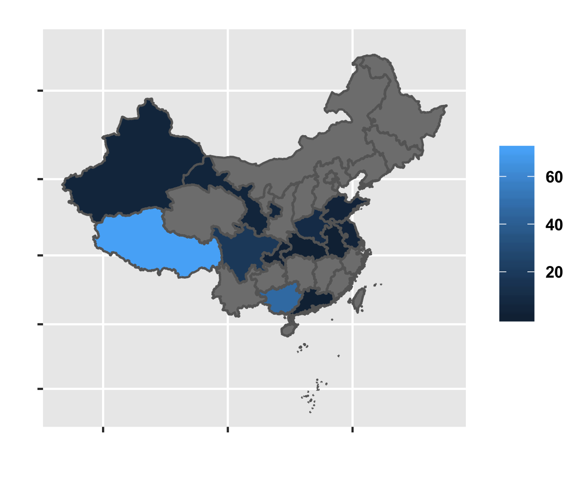
    
* Sample Distribution for NGS data
    ```R
    df_sorted <- arrange(data_sample_details_ONT, id, Type) 
    df_cumsum <- ddply(df_sorted, "id",
                       transform, 
                       ypos=cumsum(Discovery) - 0.5*Discovery)
    
    ggplot(data=df_cumsum, aes(x=id, y=Discovery, fill = Type)) +
      geom_bar(stat="identity") +
      theme_minimal()+
      theme(legend.title=element_blank(),
            legend.direction = 'horizontal',
            legend.position=c(0.5,0.98),
            legend.spacing.x = unit(0.1, 'cm'),
            legend.key.size=unit(0.3, 'cm'),
            legend.text = element_text(size = 6,face = "bold"),
            axis.text.x = element_text(size = 6,face = "bold", angle = 60, vjust = 0.6),
            axis.text.y = element_text(size = 6,face = "bold"),
            axis.title.y = element_text(size = 6,face = "bold"),
            axis.title.x.bottom = element_text(margin = margin(-15,0,0,0))) +
      scale_fill_manual(values=c('light blue', 'blue', 'purple','dark red')) + 
      xlab("") + 
      ylab("Discovery")
    ```
    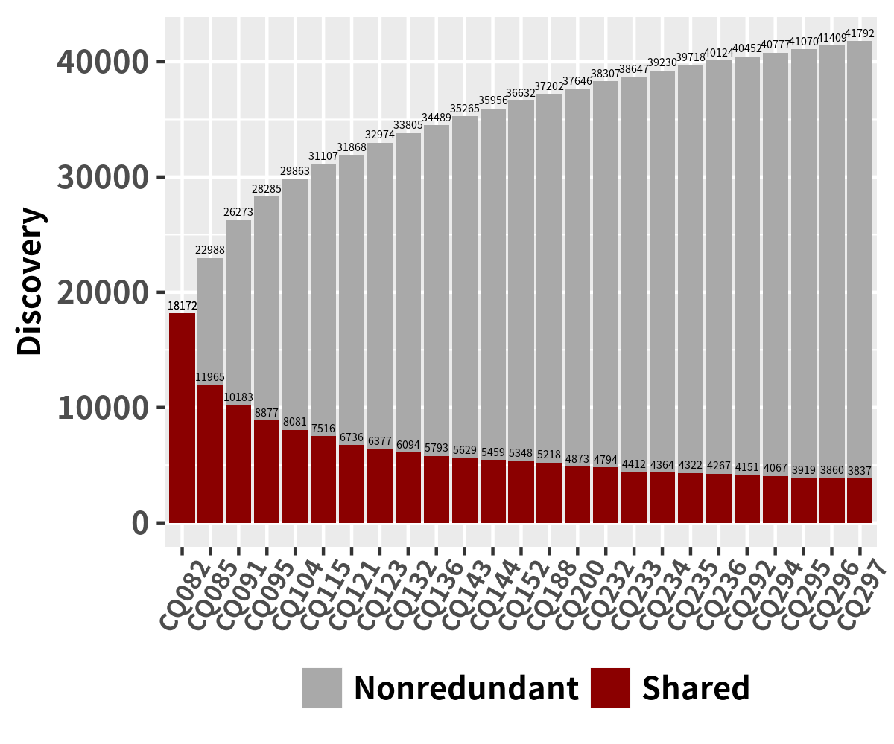

* telomere enrichment
    ```R
    ggplot(data = data_sv_dist[data_sv_dist$All!=0,],
           aes(x = Dist, y = All)) +
      geom_point(size = 0.05, color="blue") +
      annotate("rect", fill = "dark gray", alpha = 0.5, 
               xmin = 0, xmax = 5,
               ymin = -Inf, ymax = Inf)+
      xlim(0, 150) +
      # ylim(0, 250) +
      ylab('SVs Per 500kbp') +
      xlab('Telomere Distance') +
      theme_minimal()+
      theme(
        axis.text.x = element_text(size = 6,face = "bold"),
        axis.text.y = element_text(size = 6,face = "bold"),
        axis.title.y = element_text(size = 6,face = "bold"),
        axis.title.x = element_text(size = 6,face = "bold"))
    ```
    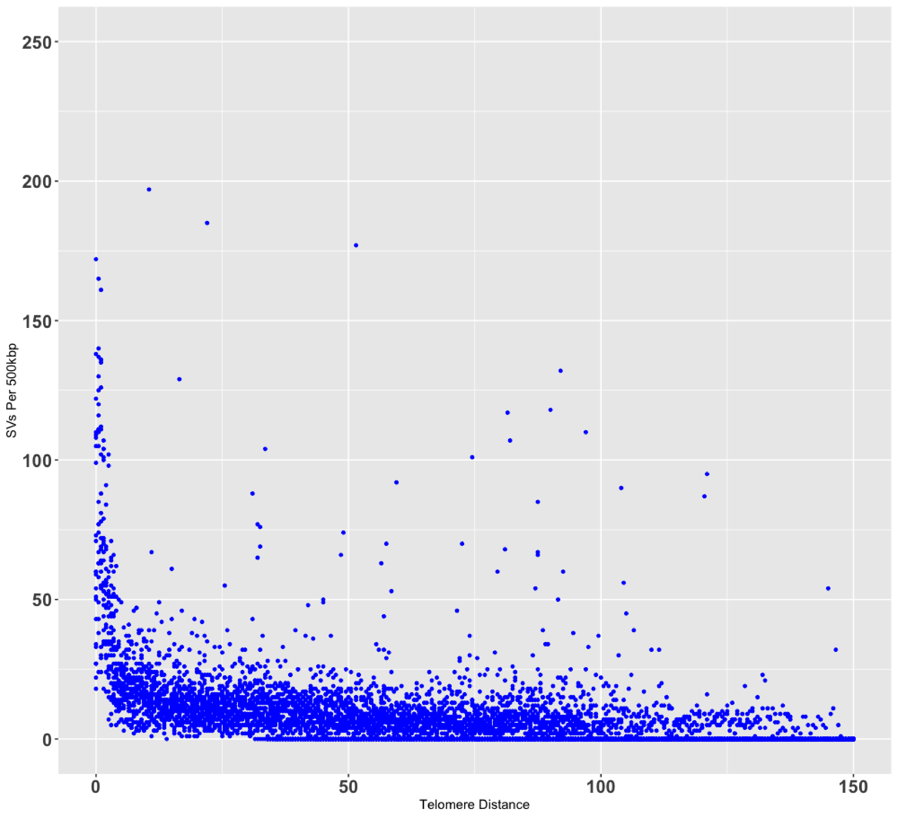
    
* Group Support
    ```R
    data_sv_group <- plyr::count(data_plot,'GROUP_SUPP')
    data_sv_group$GROUP_SUPP <- factor(data_sv_group$GROUP_SUPP)
    ggplot(data_sv_group, aes(x="",y=freq,fill=GROUP_SUPP)) + 
      geom_bar(width=1,stat="identity") + coord_polar("y",start=0) + 
      geom_text(aes(y=freq/4+c(0,cumsum(freq)[-length(freq)])), 
                label=percent(data_sv_group$freq/sum(data_sv_group$freq)),
                size=2,
                color='white', 
                fontface="bold") + 
    scale_fill_manual(values=config_color_group_supp) +
      theme_minimal() + 
      theme(legend.position = c(0.5,0),
            legend.direction = 'horizontal',
            legend.spacing.x = unit(0.1, 'cm'),
            legend.key.size=unit(0.3, 'cm'),
            legend.title=element_blank(),
            legend.text = element_text(size = 6,face = "bold"),
            panel.border = element_blank(),
            panel.grid = element_blank(),
            axis.ticks = element_blank(),
            axis.text = element_blank(),
            axis.title.x = element_blank(),
            axis.title.y = element_blank())
    ```
    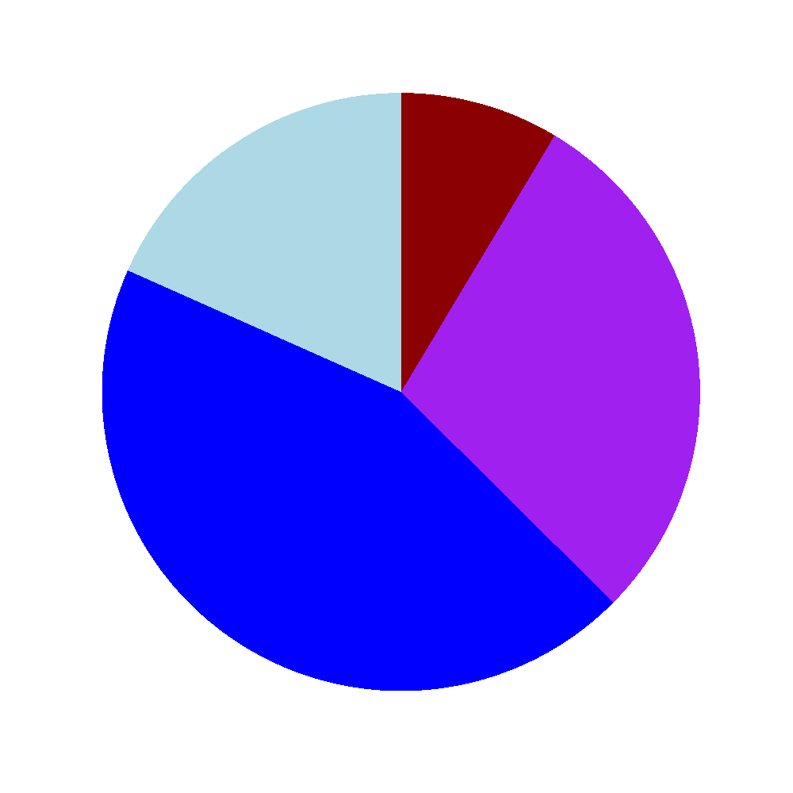
* SV length
    ```R
    ggplot(data=data_plot[data_plot$SVTYPE!='TRA',], aes(x=SVLEN, color = SVTYPE)) +
      geom_freqpoly(binwidth=1/5, size=0.8) +  
      scale_x_continuous(trans = 'log10',
                         breaks=c(100,1000,10000,100000,1000000,10000000),
                         labels =c('100bp','1kb','10kb','100kb','1Mb', '10Mb'),
                         limits = c(50, 10000000)
      ) + 
      scale_y_continuous(trans = 'log10') + 
      theme_minimal() +
      theme(legend.title=element_blank(),
            legend.position=c(0.9,0.9),
            legend.direction = 'vertical',
            legend.spacing.x = unit(0.1, 'cm'),
            legend.key.size=unit(0.3, 'cm'),
            legend.text = element_text(size = 6,face = "bold"),
            axis.text.x = element_text(size = 6,face = "bold"),
            axis.text.y = element_text(size = 6,face = "bold"),
            axis.title.y = element_text(size = 6,face = "bold"),
            axis.title.x = element_text(size = 6,face = "bold"),
            axis.title.x.bottom = element_text(margin = margin(-10,0,0,0))) + 
      scale_fill_manual(values=config_color_svtype) + 
      xlab('') + 
      ylab("SV Count")
    ```
    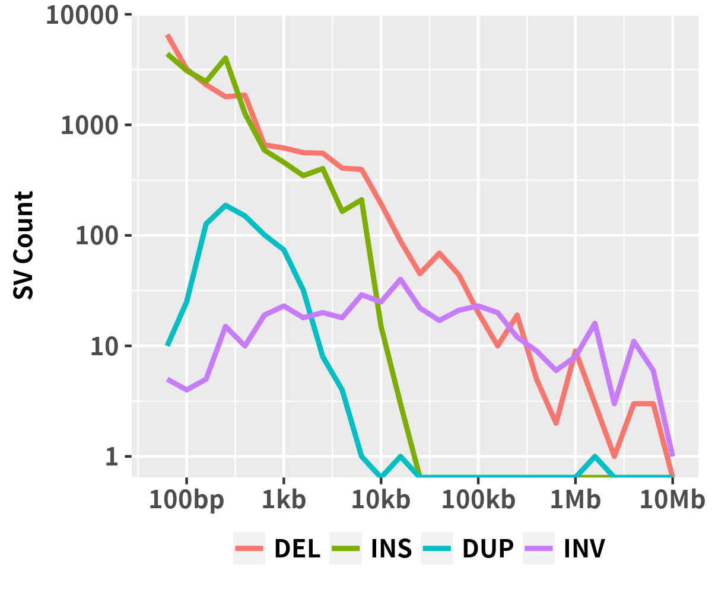

* SV length group
    ```R
        data_sv_group <- plyr::count(data_plot,c('GROUP_LEN','GROUP_SUPP'))
        data_sv_group$label <- 0
        
        for (type_sv in levels(data_sv_group$GROUP_LEN)){
          data_sv_group[data_sv_group$GROUP_LEN==type_sv,]$label <- sum(data_sv_group[data_sv_group$GROUP_LEN==type_sv,]$freq)
        }
        ggplot(data_sv_group, aes(x = GROUP_LEN, y = freq, fill = GROUP_SUPP)) + 
          geom_bar(position = "fill",stat = "identity") +
          scale_y_continuous(labels = scales::percent_format(), expand = expand_scale(mult = .1)) + 
          coord_flip() + 
          theme_minimal()+
          theme(legend.title=element_blank(),
                legend.position="bottom",
                legend.spacing.x = unit(0.1, 'cm'),
                legend.key.size=unit(0.3, 'cm'),
                legend.text = element_text(size = 6,face = "bold"),
                axis.text.x = element_text(size = 6,face = "bold"),
                axis.text.y = element_text(size = 6,face = "bold"),
                axis.title.y = element_text(size = 6,face = "bold"),
                axis.title.x.bottom = element_text(margin = margin(-10,0,0,0))) +
          scale_fill_manual(values=config_color_group_supp) + 
          xlab("") + 
          ylab("") +
          geom_text(aes(label = label, y= ..prop..), stat= "count", hjust = -0.1, size=1)
    ```
    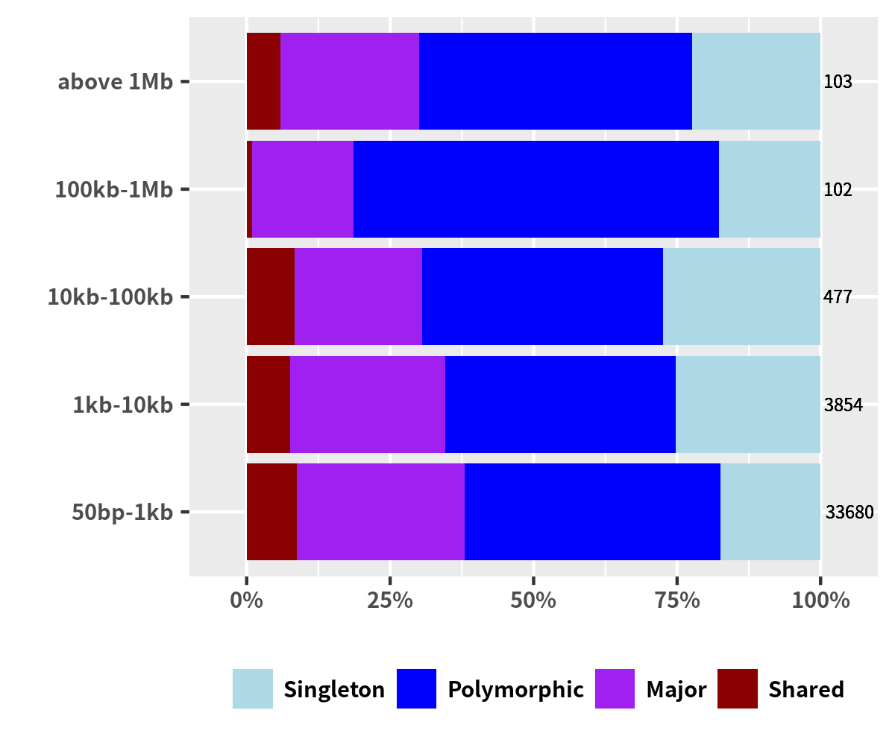

* SV type group
    ```R
        data_sv_group <- plyr::count(data_plot,c('SVTYPE','GROUP_SUPP'))
        data_sv_group$SVTYPE <- factor(data_sv_group$SVTYPE)
        data_sv_group$label <- 0
        
        for (type_sv in levels(data_sv_group$SVTYPE)){
          data_sv_group[data_sv_group$SVTYPE==type_sv,]$label <- sum(data_sv_group[data_sv_group$SVTYPE==type_sv,]$freq)
        }
        data_sv_group$SVTYPE <- factor(data_sv_group$SVTYPE, levels = c( 'DEL', 'INS', 'DUP', 'INV', 'TRA'))
        
        ggplot(data_sv_group, aes(x = SVTYPE, y = freq, fill = GROUP_SUPP)) + 
          geom_bar(position = "fill",stat = "identity") +
          scale_y_continuous(labels = scales::percent_format(), expand = expand_scale(mult = .1)) + 
          coord_flip() + 
          theme_minimal()+
          theme(legend.title=element_blank(),
                legend.position="bottom",
                legend.spacing.x = unit(0.1, 'cm'),
                legend.key.size=unit(0.3, 'cm'),
                legend.text = element_text(size = 6,face = "bold"),
                axis.text.x = element_text(size = 6,face = "bold"),
                axis.text.y = element_text(size = 6,face = "bold"),
                axis.title.y = element_text(size = 6,face = "bold"),
                axis.title.x.bottom = element_text(margin = margin(-15,0,0,0))) +
          scale_fill_manual(values=config_color_group_supp) + 
          xlab("") + 
          ylab("") +
          geom_text(aes(label = label, y= ..prop..), stat= "count", hjust = -0.1, size=2)
    ```
    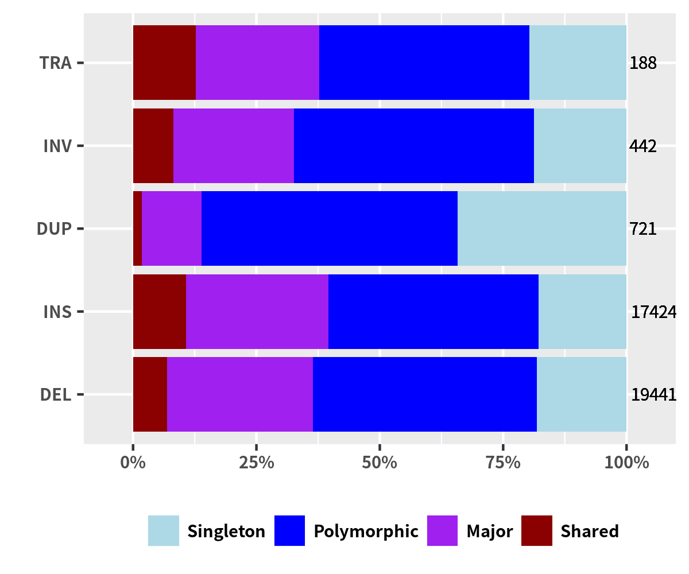

* SV breakpoints CI
    ```R
        data_tmp <- data_plot 
    
        data_tmp$GROUP_CI <- NA
        data_tmp[data_tmp$MAXCI_POS<=1000&data_tmp$MAXCI_END<=1000,]$GROUP_CI <- '500bp-1kb'
        data_tmp[data_tmp$MAXCI_POS<=500&data_tmp$MAXCI_END<=500,]$GROUP_CI <- '250bp-500bp'
        data_tmp[data_tmp$MAXCI_POS<=250&data_tmp$MAXCI_END<=250,]$GROUP_CI <- '100bp-250bp'
        data_tmp[data_tmp$MAXCI_POS<=100&data_tmp$MAXCI_END<=100,]$GROUP_CI <- '0-100bp'
        data_tmp$GROUP_CI <- factor(data_tmp$GROUP_CI, levels = c('0-100bp', '100bp-250bp', '250bp-500bp', '500bp-1kb'))
        
        
        df.new<-ddply(data_tmp,.(GROUP_SUPP),plyr::summarise,
                      prop=prop.table(table(GROUP_CI)),
                      SUPP=names(table(GROUP_CI)))
        df.new$SUPP <- factor(df.new$SUPP, levels = c('0-100bp', '100bp-250bp', '250bp-500bp', '500bp-1kb'))
        ggplot(df.new, aes(SUPP, prop, fill=GROUP_SUPP)) + 
          geom_bar(stat="identity",position = 'dodge') + 
          theme_minimal()+
          theme(legend.title=element_blank(),
                legend.position=c(0.5,0.9),
                legend.direction = 'horizontal',
                legend.spacing.x = unit(0.1, 'cm'),
                legend.key.size=unit(0.3, 'cm'),
                legend.text = element_text(size = 6,face = "bold"),
                axis.text.x = element_text(size = 6,face = "bold"),
                axis.text.y = element_text(size = 6,face = "bold"),
                axis.title.y = element_text(size = 6,face = "bold"),
                axis.title.x = element_text(size = 6,face = "bold")
                ) +
          scale_fill_manual(values=config_color_group_supp) + 
          xlab("Max Interval of Breakpoints") + 
          ylab("Prop")
    ```
    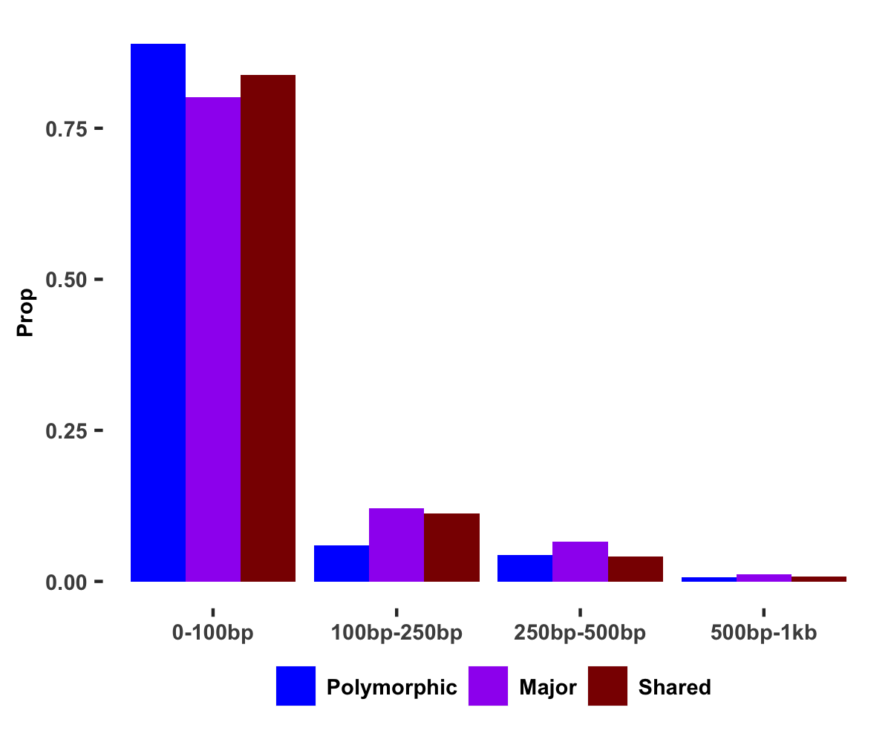


* SV breakpoints repeat length
    ```R
        ggplot(data=data_sv_repeat, aes(x=abs(SVLEN), fill = RepClass)) +
      geom_histogram() + 
      scale_x_continuous(trans = 'log10',breaks = c(100,300,2000,6000,20000),
                         labels = c('100bp','300bp','2kb','6kb','20kb'),limits = c(50,20000)) + 
      theme_minimal()+
      theme(legend.title=element_blank(),
            legend.position=c(0.8,0.65),
            legend.spacing.x = unit(0.1, 'cm'),
            legend.key.size=unit(0.3, 'cm'),
            legend.text = element_text(size = 6,face = "bold"),
            axis.text.x = element_text(size = 6,face = "bold", angle = 45),
            axis.text.y = element_text(size = 6,face = "bold"),
            axis.title.y = element_text(size = 6,face = "bold"),
            axis.title.x = element_text(size = 6,face = "bold")) +
      scale_fill_manual(values=config_color_repeat) + 
      xlab('') + 
      ylab("SV Count")
    ```
    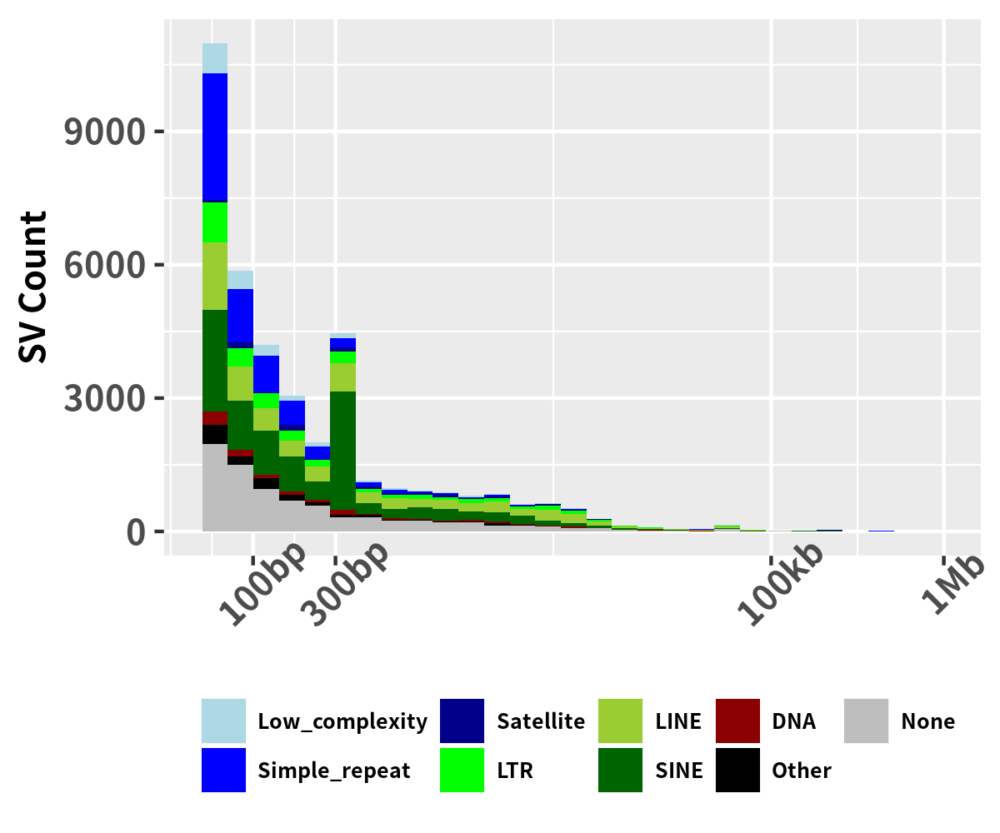

* SV breakpoints gc repeat
    ```R
        ggplot(data=data_sv_repeat, aes(x=GCcontent, fill = RepClass)) +
      geom_histogram() +
      theme_minimal()+
      theme(legend.title=element_blank(),
            legend.position='bottom',
            legend.spacing.x = unit(0.1, 'cm'),
            legend.key.size=unit(0.5, 'cm'),
            legend.text = element_text(size = 10,face = "bold"),
            axis.text.x = element_text(size = 10,face = "bold", angle = 45),
            axis.text.y = element_text(size = 10,face = "bold"),
            axis.title.y = element_text(size = 10,face = "bold"),
            axis.title.x = element_text(size = 10,face = "bold")) +
      scale_fill_manual(values=config_color_repeat) + 
      xlab('GC Content') + 
      ylab("SV Count")
    ```
    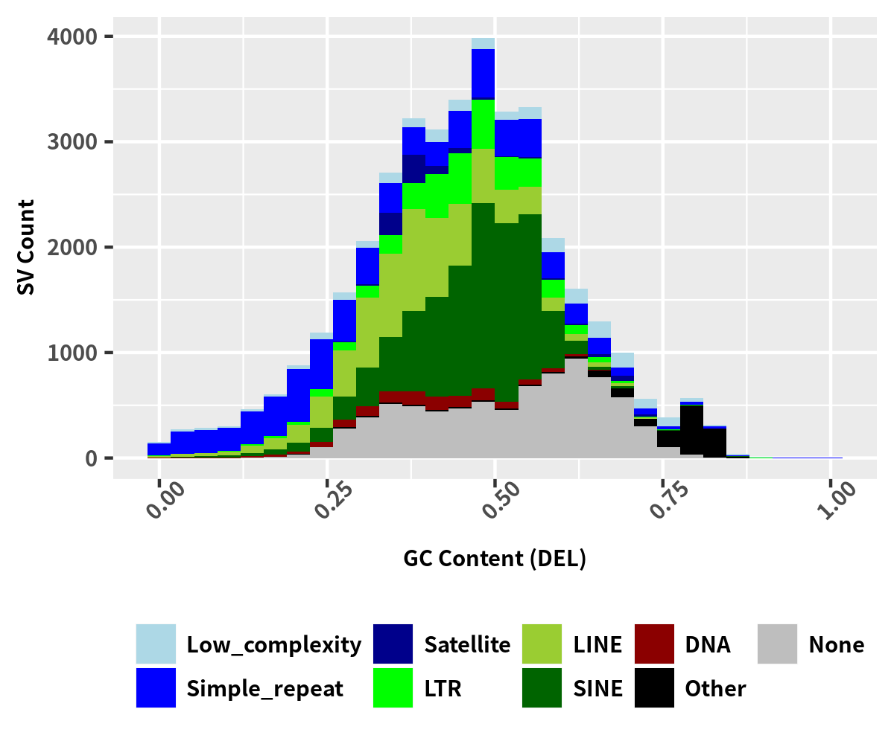

* SV Database AF
    ```R
        ggplot(data=data_plot, aes(x=AF_Database, fill = GROUP_SUPP)) +
      geom_histogram() +
      theme_minimal()+
      # scale_y_continuous(trans = 'log', breaks = c(1000,10000),labels = c('1000','10000')) +
      theme(legend.title=element_blank(),
            legend.position='bottom',
            legend.spacing.x = unit(0.1, 'cm'),
            legend.key.size=unit(0.5, 'cm'),
            legend.text = element_text(size = 10,face = "bold"),
            axis.text.x = element_text(size = 10,face = "bold", angle = 45),
            axis.text.y = element_text(size = 10,face = "bold"),
            axis.title.y = element_text(size = 10,face = "bold"),
            axis.title.x = element_text(size = 10,face = "bold")) +
      scale_fill_manual(values=config_color_group_supp) + 
      xlab('AF') + 
      ylab("Discovery")
    ```
    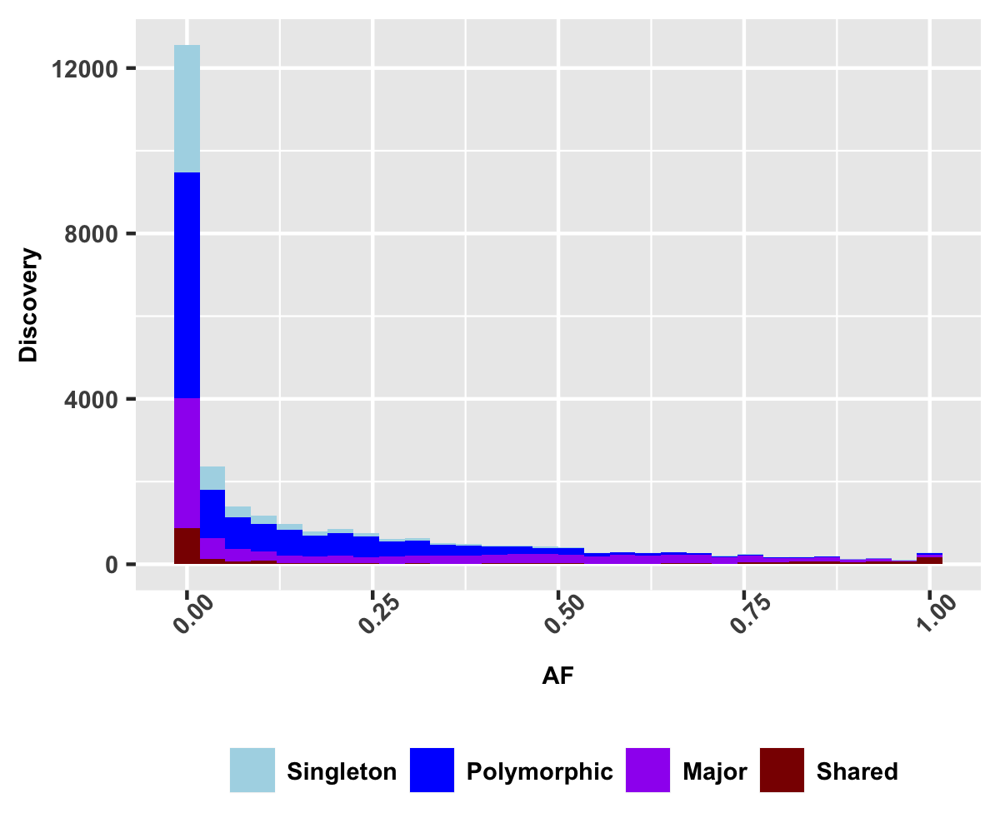

* SV Genotyping
    ```R
        data_tmp <- data_plot
        data_tmp$GROUP_SUPP_NGS <- as.character(data_tmp$GROUP_SUPP_NGS)
        data_tmp <- data_tmp[!is.na(data_tmp$MR_NGS),]
        # data_tmp <- data_tmp[!is.na(data_tmp$MR_NGS)&data_tmp$MR_NGS<0.05,]
        
        data_tmp[is.na(data_tmp$GROUP_SUPP_NGS),]$GROUP_SUPP_NGS <- 'No Support'
        data_tmp$GROUP_SUPP_NGS <- factor(data_tmp$GROUP_SUPP_NGS, levels = c('No Support','Singleton', 'Polymorphic', 'Major', 'Shared'))
        data_tmp_1 <- plyr::count(data_tmp[data_tmp$MR_NGS<0.05,],'GROUP_SUPP_NGS')
        data_tmp_2 <- plyr::count(data_tmp[data_tmp$MR_NGS<0.05&data_tmp$GROUP_SUPP_NGS=='No Support',],
                                  'GROUP_SUPP')
        data_tmp_3 <- plyr::count(data_tmp[data_tmp$MR_NGS<0.05&data_tmp$GROUP_SUPP_NGS!='No Support',],
                                  'GROUP_SUPP')
        
        ids_pie = c('SV', 'MR_0', 'MR_1', 'No_Support', 'Support')
        labels_pie = c('SV genotyping', 'MR < 0.05', 'MR >= 0.05', 'genotyped AF = 0', 'genotyped AF > 0')
        parents_pie = c('', 'SV', 'SV', 'MR_0', 'MR_0')
        values_pie = c(nrow(data_tmp),
                       sum(data_tmp$MR_NGS<0.05),
                       sum(data_tmp$MR_NGS>=0.05),
                       data_tmp_1[data_tmp_1$GROUP_SUPP_NGS=='No Support',]$freq,
                       sum(data_tmp_1$freq)-data_tmp_1[data_tmp_1$GROUP_SUPP_NGS=='No Support',]$freq)
        
        for (label_condition in data_tmp_2$GROUP_SUPP) {
          
          ids_pie <- c(ids_pie, paste(label_condition, 'No_Support', sep = '_'))
          labels_pie <- c(labels_pie, label_condition)
          parents_pie <- c(parents_pie, 'No_Support')
          values_pie <- c(values_pie, data_tmp_2[data_tmp_2$GROUP_SUPP==label_condition,]$freq)
        }
        
        for (label_condition in data_tmp_3$GROUP_SUPP) {
          
          ids_pie <- c(ids_pie, paste(label_condition, 'Support', sep = '_'))
          labels_pie <- c(labels_pie, label_condition)
          parents_pie <- c(parents_pie, 'Support')
          values_pie <- c(values_pie, data_tmp_3[data_tmp_3$GROUP_SUPP==label_condition,]$freq)
        }
        
        
        data_sv_group <- subset(data_tmp, GROUP_SUPP_NGS=='No Support' & MR_NGS <= 0.05)
        
        data_sv_group$GROUP_REP <- 'None'
        data_sv_group[data_sv_group$RepClass!='None',]$GROUP_REP <- 'Repclass'
        data_sv_group[data_sv_group$RepClass=='None'&data_sv_group$SD!='',]$GROUP_REP <- 'SD'
        data_sv_group[data_sv_group$GROUP_REP=='None'&
                        (data_sv_group$Repeats_type_left!='None'|data_sv_group$Repeats_type_right!='None'),]$GROUP_REP <- 'flanked'
        
        data_tmp_4 <- plyr::count(data_sv_group,c('GROUP_SUPP','GROUP_REP'))
        
        for (label_group in data_tmp_2$GROUP_SUPP){
          for (label_condition in unique(data_tmp_4$GROUP_REP)) {
            
            ids_pie <- c(ids_pie, paste(label_condition, label_group, 'No_Support', sep = '_'))
            labels_pie <- c(labels_pie, label_condition)
            parents_pie <- c(parents_pie, paste(label_group,'No_Support', sep = '_'))
            values_pie <- c(values_pie, data_tmp_4[data_tmp_4$GROUP_SUPP==label_group&
                                                     data_tmp_4$GROUP_REP==label_condition,]$freq)
          }
        }
        
        if (!require("processx")) install.packages("processx")
        fig <- plot_ly(
          ids=ids_pie,
          labels=labels_pie, 
          parents=parents_pie,
          values=values_pie,
          type='sunburst',
          branchvalues = 'total'
        )
        orca(fig, "../data/result_genotypted/plots/genotyping.pie.svg")
    ```
    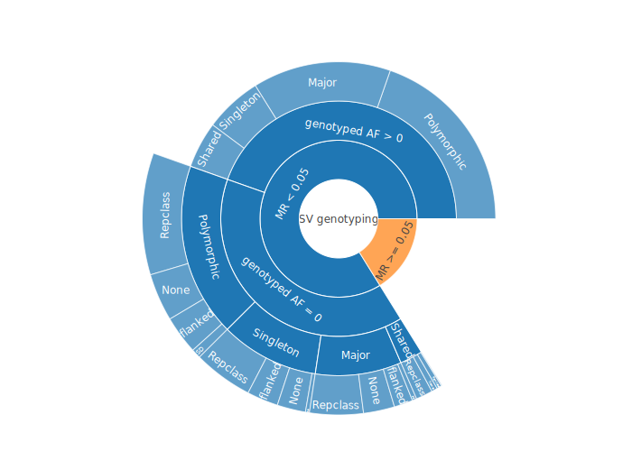

    * SV Genotyping HardyWeinberg
    ```R
        library(HardyWeinberg)
        
        plot.HWE <- function(dat,pop=NULL,title=NULL,full.legend=F,lab.cex=1){
          require(HardyWeinberg,quietly=T)
          #Gather HW p-values & colors
          HWE.mat <- dat
          HW.p <- HWChisqStats(X=HWE.mat,x.linked=F,pvalues=T)
          HW.cols <- rep("#4DAC26",times=length(HW.p))
          HW.cols[which(HW.p<0.05)] <- "#81F850"
          HW.cols[which(HW.p<0.05/length(HW.p))] <- "#AC26A1"
          
          #Generate HW plot frame
          par(mar=c(1,1,1,1),bty="n")
          plot(x=1.15*c(-1/sqrt(3),1/sqrt(3)),y=c(-0.15,1.15),type="n",
               xaxt="n",yaxt="n",xlab="",ylab="",xaxs="i",yaxs="i")
          segments(x0=c(-1/sqrt(3),0,1/sqrt(3)),
                   x1=c(0,1/sqrt(3),-1/sqrt(3)),
                   y0=c(0,1,0),y1=c(1,0,0))
          HWTernaryPlot(X=HWE.mat,n=max(HWE.mat,na.rm=T),newframe=F,
                        vbounds=F,mafbounds=F,
                        region=1,vertexlab=NA,
                        alpha=0.05,
                        curvecols=c("#4DAC26","#81F850",NA,NA),pch=NA)
          
          #Add axes
          text(x=c(-1/sqrt(3),1/sqrt(3)),y=0,labels=c("0/0","1/1"),
               pos=1,cex=lab.cex,xpd=T,font=2)
          text(x=0,y=1,labels="0/1",pos=3,cex=lab.cex,xpd=T,font=2)
          
          #Finish HW plot
          HWTernaryPlot(X=HWE.mat,n=max(HWE.mat,na.rm=T),newframe=F,
                        vbounds=F,mafbounds=F,
                        region=1,vertexlab=NA,
                        alpha=0.03/nrow(HWE.mat),
                        curvecols=c("#4DAC26","#AC26A1",NA,NA),
                        pch=21,cex=0.3,signifcolour=F,markercol=NA,
                        markerbgcol=adjustcolor(HW.cols,alpha=0.25))
          segments(x0=c(-1/sqrt(3),0,1/sqrt(3)),
                   x1=c(0,1/sqrt(3),-1/sqrt(3)),
                   y0=c(0,1,0),y1=c(1,0,0))
          
          #Add legend
          n.pass <- length(which(HW.p>=0.05))
          print(paste("PASS: ",n.pass/length(HW.p),sep=""))
          n.nom <- length(which(HW.p<0.05 & HW.p>=0.05/nrow(HWE.mat)))
          print(paste("NOMINAL FAILS: ",n.nom/length(HW.p),sep=""))
          n.bonf <- length(which(HW.p<0.05/nrow(HWE.mat)))
          print(paste("BONFERRONI FAILS: ",n.bonf/length(HW.p),sep=""))
          legend("right",pch=19,col=c("#4DAC26","#81F850","#AC26A1"),pt.cex=1,
                 legend=c(paste(round(100*(n.pass/nrow(HWE.mat)),0),"%",sep=""),
                          paste(round(100*(n.nom/nrow(HWE.mat)),0),"%",sep=""),
                          paste(round(100*(n.bonf/nrow(HWE.mat)),0),"%",sep="")),
                 bty="n",bg=NA,cex=lab.cex)
          text(x=par("usr")[2],y=par("usr")[4]-(0.2*(par("usr")[4]-par("usr")[3])),pos=2,cex=lab.cex,
               labels=paste(title,"\n \n ",sep=""),font=2)
          text(x=par("usr")[2],y=par("usr")[4]-(0.2*(par("usr")[4]-par("usr")[3])),pos=2,cex=lab.cex,
               labels=paste(" \n",prettyNum(max(apply(HWE.mat,1,sum),na.rm=T),big.mark=",")," Samples\n ",sep=""))
          text(x=par("usr")[2],y=par("usr")[4]-(0.2*(par("usr")[4]-par("usr")[3])),pos=2,cex=lab.cex,
               labels=paste(" \n \n",prettyNum(nrow(HWE.mat),big.mark=",")," SV",sep=""))
        }
        
        data_genotypes_normal <- data_genotypes[
          (!is.na(data_sv_details_all$AF_ALL_NGS))&
            data_sv_details_all$MR_NGS<0.05&
            data_sv_details_all$AF_ALL_NGS>0.01&
            data_sv_details_all$AF_ALL_NGS<1,
          colnames(data_genotypes)%in%data_samples_info[data_samples_info$Platform=='NGS',]$SampleID]
        data_genotypes_normal[data_genotypes_normal==-1] <- 0
        
        data_genotypes_hw <- data_genotypes_normal
        data_genotypes_hw$AA <- rowSums(data_genotypes_normal==0)
        data_genotypes_hw$AB <- rowSums(data_genotypes_normal==1)
        data_genotypes_hw$BB <- rowSums(data_genotypes_normal==2)
        
        data_genotypes_hw <- data_genotypes_hw[,c('AA','AB','BB')]
        # png(filename = paste(prefix_filename,'genotyping.hardyweinberg.png',sep = '.'), width = 1000, height = 1000, res = val_res)
       plot.HWE(data_genotypes_hw, lab.cex = 1)
    ```
    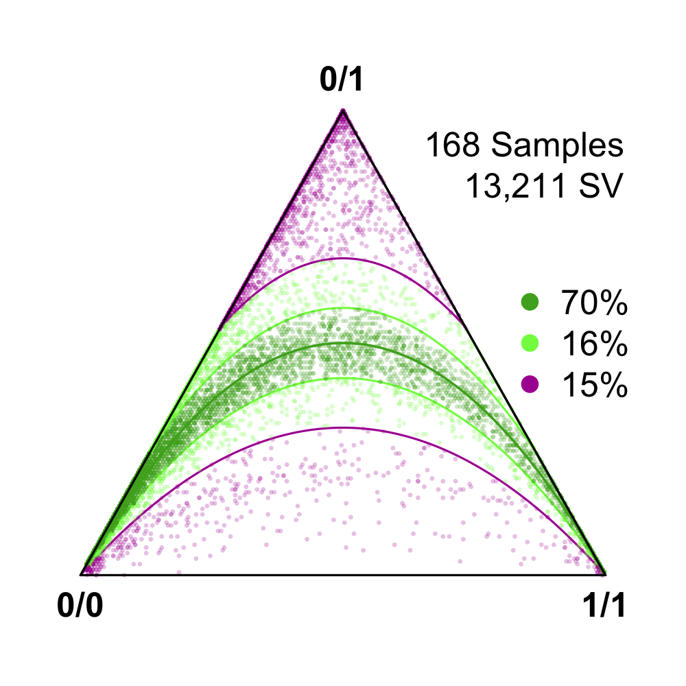


* SV Genotyping
    ```R
        tmp <- subset(data_plot, SUPP_NGS>0)
        df.new<-ddply(tmp,.(SVTYPE),plyr::summarise,
                      prop=prop.table(table(GROUP_SUPP_NGS)),
                      SUPP=names(table(GROUP_SUPP_NGS)))
        df.new$SUPP <- factor(df.new$SUPP, levels = c('Singleton', 'Polymorphic', 'Major', 'Shared'))
        ggplot(df.new, aes(SUPP, prop, fill=SVTYPE)) + 
          geom_bar(stat="identity",position = 'dodge') + 
          theme_minimal()+
          theme(legend.title=element_blank(),
                legend.position=c(0.9,0.8),
                panel.border = element_blank(),
                panel.grid = element_blank(),
                panel.background = element_blank(),
                legend.spacing.x = unit(0.1, 'cm'),
                legend.key.size=unit(0.3, 'cm'),
                legend.text = element_text(size = 6,face = "bold"),
                axis.text.x = element_text(size = 6,face = "bold"),
                axis.text.y = element_text(size = 6,face = "bold"),
                axis.title.y = element_text(size = 6,face = "bold"),
                axis.title.x.bottom = element_text(margin = margin(-15,0,0,0))) +
          scale_fill_manual(values=config_color_svtype) + 
          xlab("") + 
          ylab("Prop")
    ```
    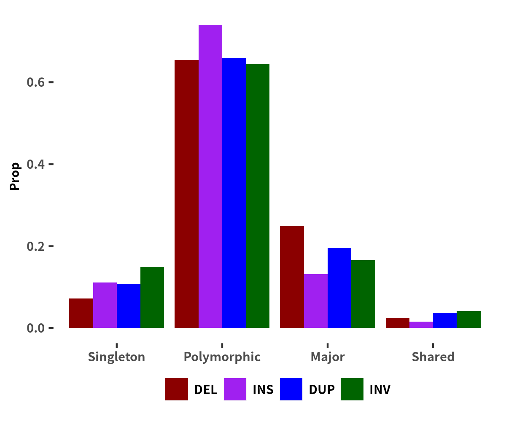

* SV Genotyping SUPP
    ```R
        ggplot(data=data_tmp, aes(x=SUPP, fill = GROUP_SUPP_NGS)) +
      geom_bar() +
      theme_minimal()+
      theme(legend.title=element_blank(),
            legend.position=c(0.5,0.9),
            legend.direction = 'horizontal',
            legend.spacing.x = unit(0.1, 'cm'),
            legend.key.size=unit(0.3, 'cm'),
            legend.text = element_text(size = 6,face = "bold"),
            axis.text.x = element_text(size = 6,face = "bold", angle = 45),
            axis.text.y = element_text(size = 6,face = "bold"),
            axis.title.y = element_text(size = 6,face = "bold"),
            axis.title.x = element_text(size = 6,face = "bold")) +
      scale_fill_manual(values=config_color_group_supp_han) + 
      xlab('Samples Support') + 
      ylab("Discovery")
    ```
    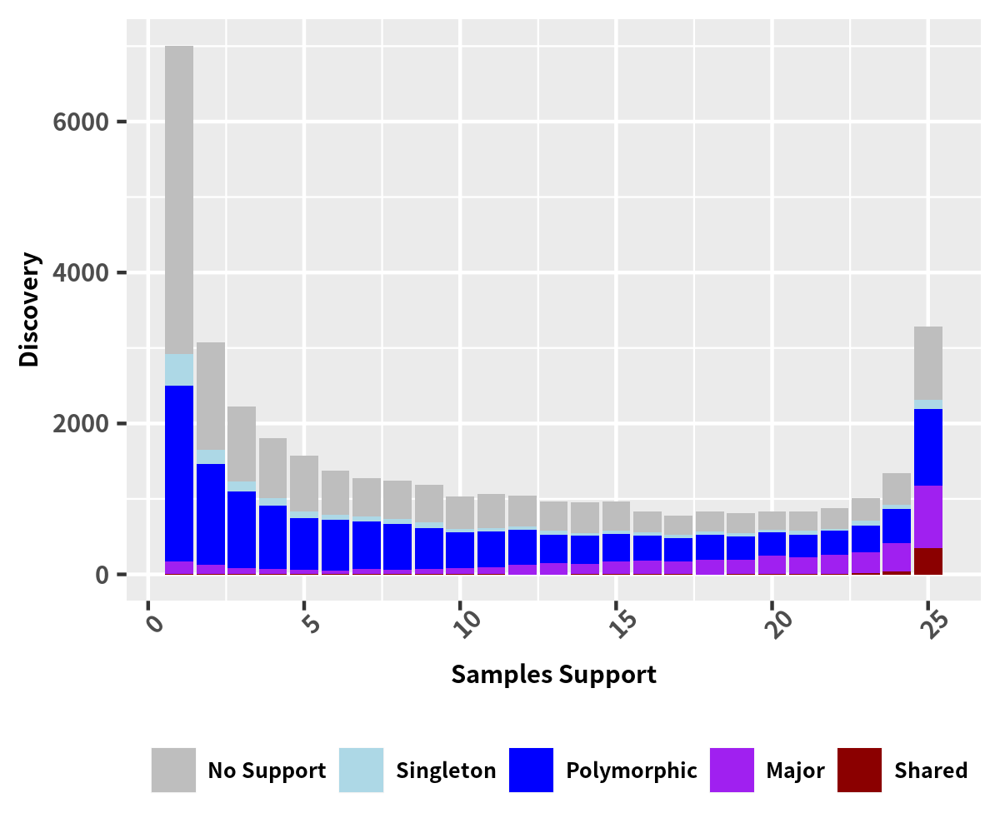


* SV Genotyping LD
    ```R
        ggplot(data_sv_group, aes(x=SVTYPE, y=LD,group=SVTYPE)) + 
      geom_boxplot(aes(fill=SVTYPE),outlier.size = 0.1) + 
      theme_minimal()+
      theme(legend.title=element_blank(),
            legend.position='bottom',
            # panel.border = element_blank(),
            # panel.grid = element_blank(),
            panel.background = element_blank(),
            legend.spacing.x = unit(0.1, 'cm'),
            legend.key.size=unit(0.5, 'cm'),
            legend.text = element_text(size = 10,face = "bold"),
            axis.text.x = element_text(size = 10,face = "bold"),
            axis.text.y = element_text(size = 10,face = "bold"),
            axis.title.y = element_text(size = 10,face = "bold"),
            axis.title.x = element_text(size = 10,face = "bold"),
            axis.title.x.bottom = element_text(margin = margin(-10,0,0,0))) +
      scale_fill_manual(values=config_color_svtype) + 
      xlab('') + 
      ylab("max LD")
    ```
    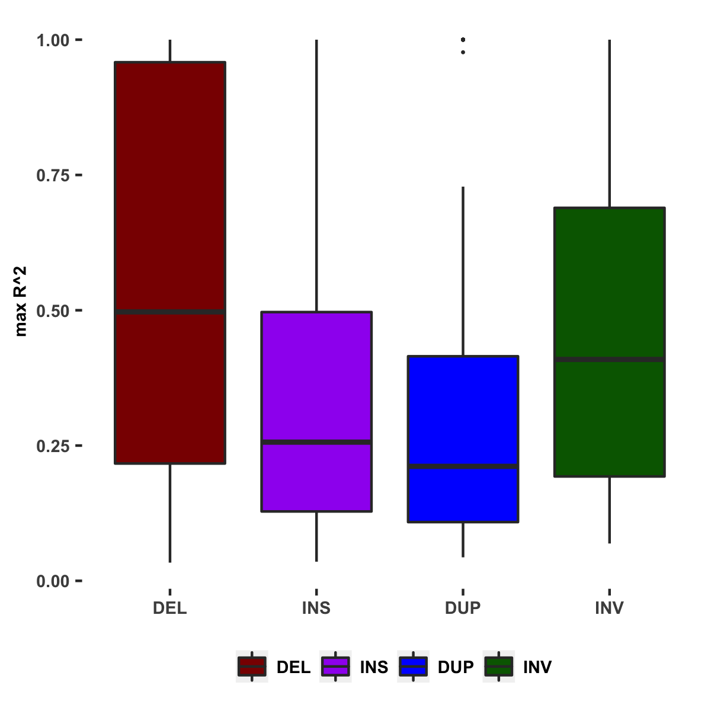

* SV gene enrichment
    ```R
        data.gene.background <- read.xlsx('example/enrich.xlsx')
    
        for (index_row in seq(nrow(data.gene.background))) {
        
          tmp <- fisher.test(matrix(c(data.gene.background[index_row,]$A1,
                                      data.gene.background[index_row,]$A0,
                                      data.gene.background[index_row,]$N1,
                                      data.gene.background[index_row,]$N0),nrow = 2))
          data.gene.background[index_row,]$Odds.Ratio <- tmp$estimate
          data.gene.background[index_row,]$p.value <- tmp$p.value
        }
        
        data.gene.background$Gene.Set <- factor(data.gene.background$Gene.Set, levels = rev(data.gene.background$Gene.Set[order(data.gene.background$Odds.Ratio,decreasing = TRUE)]))
        ggplot(data=data.gene.background[2:11,],aes(x=Gene.Set,
                                                  y=A1,
                                                  fill=p.value)) + 
          geom_bar(stat="identity") + coord_flip() + 
          theme(panel.background=element_rect(fill='transparent',colour = 'black'),
                legend.key.size=unit(0.2, 'cm'),
                legend.title=element_blank(),
                legend.text = element_text(size = 2.5,face = "bold"),
                axis.text.x = element_text(size = 2.5,face = "bold"),
                axis.text.y = element_text(color="black",size=2.5,face = "bold"),
                axis.title.y = element_text(size = 2.5,face = "bold")) + 
          scale_fill_gradient(low="red",high="blue", breaks=c(0.05, 0.1), limits=c(0, 0.15)) +
          xlab("") + 
          ylab("")
    ```
    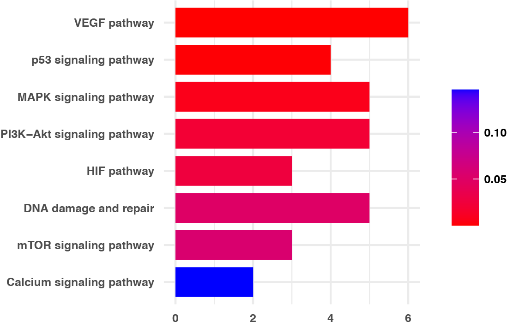

* SV Genotyping VAF
    ```R    
        data_tmp <- data_plot[!is.na(data_plot$AF_ALL_NGS)&data_plot$MR_NGS<0.05&data_plot$AF_ALL_NGS>0&data_plot$AF_ALL_NGS<0.1,]
        pdf(file = paste(prefix_filename,'genotyping.pop.vaf.group_pop_detail','pdf',sep = '.'), width = 3, height = 3)
        ggplot(data=data_tmp, aes(AF_ALL_NGS, stat(count), fill = GROUP_POP_DETAIL_NGS)) +
          geom_density(position = "fill",bw=0.005) + 
          scale_fill_manual(values=config_color_group_pop)+ 
          theme_minimal()+
          theme(legend.title=element_blank(),
                legend.position='bottom',
                legend.spacing.x = unit(0.1, 'cm'),
                legend.key.size=unit(0.3, 'cm'),
                legend.text = element_text(size = 6,face = "bold"),
                axis.text.x = element_text(size = 6,face = "bold"),
                axis.text.y = element_text(size = 6,face = "bold"),
                axis.title.y = element_text(size = 6,face = "bold"),
                axis.title.x = element_text(size = 6,face = "bold"),
                axis.title.x.bottom = element_text(margin = margin(5,0,0,0))) + 
          xlab('VAF') + 
          ylab("Proportion")
        dev.off()
    ```
    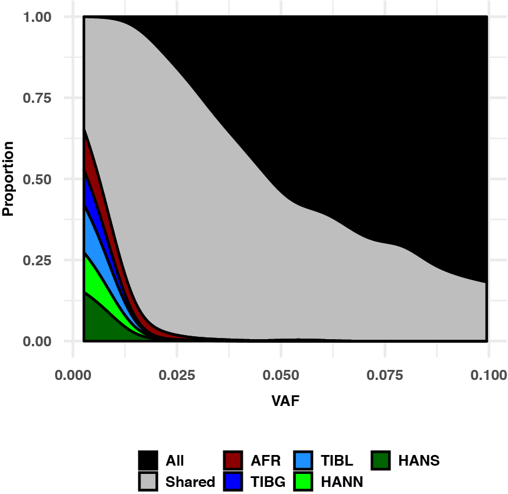

* SV Genotyping PCA
    ```R    
        group_sample <- as.data.frame(data_samples_info[!data_samples_info$Source%in%c('T15H10','HUM'),c('SampleID','Group','Group_Detail','Location')])
        group_sample <- group_sample[order(group_sample$SampleID),]
        rownames(group_sample) <- group_sample$SampleID
        
        data_genotypes_normal <- data_genotypes[!is.na(data_sv_details_all$AF_ALL_NGS)&data_sv_details_all$MR_NGS<0.05&data_sv_details_all$AF_ALL_NGS>0.01,colnames(data_genotypes)%in%group_sample$SampleID]
        data_genotypes_normal <- data_genotypes_normal[, order(colnames(data_genotypes_normal))]
        data_genotypes_normal[data_genotypes_normal==-1] <- 0
        # tmp <- (data_genotypes_normal- rowMeans(data_genotypes_normal))/(1+(2*sqrt(data_sv_details_all$AF_ALL_NGS*(1-data_sv_details_all$AF_ALL_NGS))))
        p <- (1 + rowSums(data_genotypes_normal))/(2+2*nrow(group_sample))
        tmp <- (data_genotypes_normal- rowMeans(data_genotypes_normal))/2*sqrt(p*(1-p))
        data_sv_details_all_matrix.pca <- prcomp(t(as.matrix(tmp)))
        PCi<-data.frame(data_sv_details_all_matrix.pca$x,Group_Detail=group_sample$Group_Detail)
        
        ggplot(PCi,aes(x=PC1,y=PC2,color=Group_Detail))+
          geom_point(size=0.8)+
          scale_color_manual(values = config_color_group_pop) + 
          theme_minimal()+
          theme(legend.title=element_blank(),
                legend.position=c(0.1,0.9),
                legend.spacing.x = unit(0.1, 'cm'),
                legend.key.size=unit(0.3, 'cm'),
                # panel.background = element_blank(),
                # # panel.border =  element_rect(size=0.6, colour = "black"),
                # axis.line = element_line(size=0.6, colour = "black"),
                # axis.line.x.top = element_line(size=0.6, colour = "black"),
                legend.text = element_text(size = 6,face = "bold"),
                axis.text.x = element_text(size = 6,face = "bold"),
                axis.text.y = element_text(size = 6,face = "bold"),
                axis.title.y = element_text(size = 6,face = "bold"),
                axis.title.x = element_text(size = 6,face = "bold"),
                axis.title.x.bottom = element_text(margin = margin(5,0,0,0))
                )
    ```
    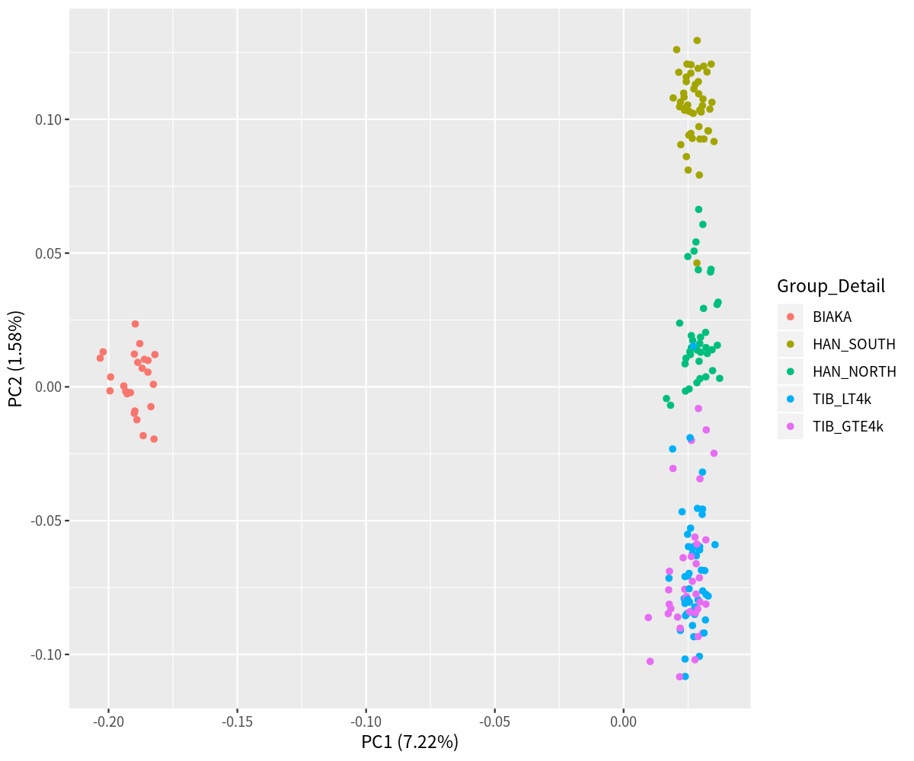

* SV Genotyping PHt
    ```R    
        group_sample <- as.data.frame(data_samples_info[!data_samples_info$Source%in%c('T15H10'),
                                                        c('SampleID','Group','Group_Detail','Location')])
        group_sample <- group_sample[order(group_sample$SampleID),]
        group_sample$PHt <- 0
        group_sample$PHot <- 0
        rownames(group_sample) <- group_sample$SampleID
        
        data_genotypes_normal <- data_genotypes[!is.na(data_sv_details_all$AF_ALL_NGS)&data_sv_details_all$MR_NGS<0.05&data_sv_details_all$AF_ALL_NGS>0.01,colnames(data_genotypes)%in%group_sample$SampleID]
        data_genotypes_normal <- data_genotypes_normal[, order(colnames(data_genotypes_normal))]
        data_genotypes_normal[data_genotypes_normal==-1] <- 0
        data_genotypes_normal_type <- data_sv_details_all[!is.na(data_sv_details_all$AF_ALL_NGS)&data_sv_details_all$MR_NGS<0.05&data_sv_details_all$AF_ALL_NGS>0.01,]$SVTYPE
        
        
        for (tmp_sample in group_sample$SampleID) {
          group_sample[group_sample$SampleID==tmp_sample,]$PHt <- sum(data_genotypes_normal[data_genotypes_normal_type%in%c('INS','DEL'),tmp_sample]==1)
          group_sample[group_sample$SampleID==tmp_sample,]$PHot <- sum(data_genotypes_normal[data_genotypes_normal_type%in%c('INS','DEL'),tmp_sample]==2)
        }
        
        group_sample_svtype <- rbind(group_sample,group_sample)
        group_sample_svtype$SVTYPE <- c(rep('DEL', nrow(group_sample)),
                                        rep('INS', nrow(group_sample)))
        
        for (tmp_svtype in unique(group_sample_svtype$SVTYPE)) {
          for (tmp_sample in group_sample$SampleID) {
            group_sample_svtype[group_sample_svtype$SampleID==tmp_sample&group_sample_svtype$SVTYPE==tmp_svtype,]$PHt <- sum(data_genotypes_normal[data_genotypes_normal_type==tmp_svtype,tmp_sample]==1)
            group_sample_svtype[group_sample_svtype$SampleID==tmp_sample&group_sample_svtype$SVTYPE==tmp_svtype,]$PHot <- sum(data_genotypes_normal[data_genotypes_normal_type==tmp_svtype,tmp_sample]==2)
          }
        }
        
        # group_sample <-group_sample[!group_sample$Group_Detail%in%c('HUM','AFR'),]
        group_sample <-group_sample[!group_sample$Group_Detail%in%c('HUM'),]
        group_sample_svtype <-group_sample_svtype[!group_sample_svtype$Group_Detail%in%c('HUM'),]
        # group_sample <- group_sample[!group_sample$SampleID%in%c('WGC025266D', 'WGC025273D'),]
        group_sample$Location <- factor(group_sample$Location, levels = unique(c(
          group_sample[group_sample$Group_Detail=='TIBG',]$Location,
          group_sample[group_sample$Group_Detail=='TIBL',]$Location,
          group_sample[group_sample$Group_Detail=='HANN',]$Location,
          group_sample[group_sample$Group_Detail=='HANS',]$Location,
          group_sample[group_sample$Group_Detail=='AFR',]$Location
        )))
        
        pairwise.t.test(group_sample$PHot, g = group_sample$Group_Detail, p.adjust.method = 'bonferroni')
        pairwise.t.test(group_sample$PHt, g = group_sample$Group_Detail, p.adjust.method = 'bonferroni')
        
        p1 <- ggplot(group_sample, aes(x=Group_Detail, y=PHot, fill=Group_Detail)) + 
          geom_violin() + 
          coord_flip() +
          # geom_signif(comparisons = list(c('TIBG','TIBL')), map_signif_level=TRUE)
          #geom_signif(comparisons = list(levels(factor(group_sample$Group_Detail))), map_signif_level=TRUE)
          scale_fill_manual(values=config_color_group_pop) +
          theme_minimal()+
          theme(legend.title=element_blank(),
                legend.position='none',
                legend.spacing.x = unit(0.1, 'cm'),
                legend.key.size=unit(0.5, 'cm'),
                legend.text = element_text(size = 6,face = "bold"),
                panel.border = element_blank(),
                panel.grid = element_blank(),
                panel.background = element_blank(),
                axis.line.x = element_line(size=0.6, colour = "black"),
                axis.line.y = element_line(size=0.6, colour = "black"),
                axis.text.x = element_text(size = 6,face = "bold",vjust = 0.6),
                axis.text.y = element_text(size = 6,face = "bold"),
                axis.title.y = element_text(size = 6,face = "bold"),
                axis.title.x = element_text(size = 6,face = "bold"),
                axis.title.x.bottom = element_text(margin = margin(5,0,0,0))) + 
          xlab('') + 
          ylab("#hom")
        p2 <- ggplot(group_sample, aes(x=Group_Detail, y=PHt, fill=Group_Detail)) + 
          geom_violin() + 
          coord_flip() + 
          scale_fill_manual(values=config_color_group_pop) + 
          theme_minimal()+
          theme(legend.title=element_blank(),
                legend.position='none',
                legend.spacing.x = unit(0.1, 'cm'),
                legend.key.size=unit(0.5, 'cm'),
                panel.border = element_blank(),
                panel.grid = element_blank(),
                panel.background = element_blank(),
                axis.line.x = element_line(size=0.6, colour = "black"),
                axis.text.y = element_blank(),
                axis.ticks.y = element_blank(),
                legend.text = element_text(size = 6,face = "bold"),
                axis.text.x = element_text(size = 6,face = "bold",vjust = 0.6),
                axis.title.x = element_text(size = 6,face = "bold"),
                axis.title.x.bottom = element_text(margin = margin(5,0,0,0))) + 
          xlab('') + 
          ylab("#het")
        # ggarrange(p1, p2,ncol=2,nrow = 1)
        multiplot(p1,p2,cols = 2)
    ```
    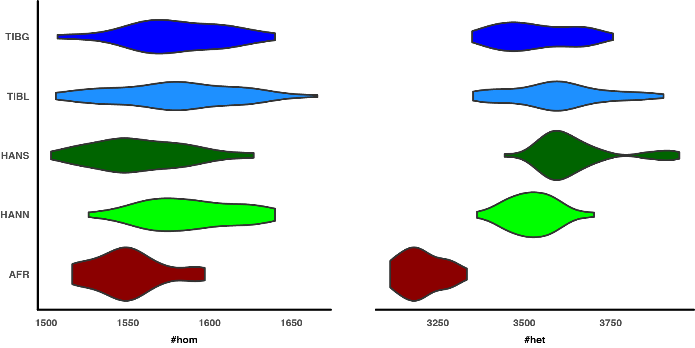

* SV Genotyping FST
    ```R    
        library(qqman)
        library(Cairo)
        
        Fstfile <- read.table(paste('example/merge.paragraph.genotypes.TIBvsHAN.20k_5k.windowed.weir.fst', sep = ''), header = T, stringsAsFactors = F)
        SNP <- paste(Fstfile[,1], Fstfile[,2], sep = ':')
        Fstfile <- cbind(SNP, Fstfile)
        colnames(Fstfile) <- c('SNP', 'CHR', 'POS','END','Bins', 'Fst','mean')
        Fstfile[Fstfile$CHR == 'chrX',]$CHR <- 'chr23'
        Fstfile$CHR <- as.numeric(str_split_fixed(Fstfile$CHR,'chr',2)[,2])
        
        filePNG <-paste(prefix_filename,'genotyping.pop.fst.pdf',sep = '.')
        CairoPNG(file=filePNG, width = 1500, height = 500)
        CairoPDF(file = filePNG,
                 width = 8, height = 4, onefile = TRUE, family = "Helvetica")
        colorset <- c('#FF0000', '#FFD700', '#2E8B57', '#7FFFAA', '#6495ED', '#0000FF', '#FF00FF')
        manhattan(Fstfile, chr='CHR', bp='POS', p='Fst', snp='SNP', col=colorset, 
                  logp=FALSE, 
                  suggestiveline=0.15, 
                  genomewideline=FALSE, 
                  ylab='Fst', 
                  ylim=c(0,0.6), 
                  font.lab=4,
                  cex.lab=0.8,  
                  cex=0.1, 
                  chrlabs = c(1:22, "X"))
        dev.off()
    ```
    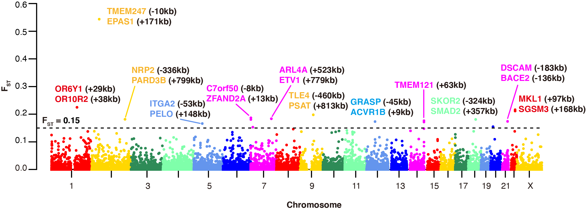

* SV Genotyping admixture
    ```R    
        # Assign the first argument to prefix
        prefix=paste('example/admixture/merge.paragraph.genotypes.local.reformat.addPopInfo.addFST.LDpruned',sep = '')
        
        # Get individual names in the correct order
        labels <- data.frame('ind' <- colnames(data_sv_details_raw@gt)[27:217], 'pop' <- NA)
        names(labels)<-c("ind","pop")
        labels <- labels[labels$ind%in%data_samples_info$SampleID,]
        index_sample <- 1
        while (index_sample <= nrow(labels)) {
          labels[index_sample,]$pop <- as.character(data_samples_info[data_samples_info$SampleID==labels[index_sample,]$ind,]$Group_Detail)
          index_sample <- index_sample + 1
        }
        
        # Add a column with population indices to order the barplots
        # Use the order of populations provided as the fourth argument (list separated by commas)
        labels$n<-factor(labels$pop,levels=unlist(strsplit('AFR,HANS,HANN,TIBL,TIBG',",")))
        levels(labels$n)<-c(1:length(levels(labels$n)))
        labels$n<-as.integer(as.character(labels$n))
        
        # read in the different admixture output files
        maxK=7
        tbl<-lapply(2:maxK, function(x) read.table(paste0(prefix,".",x,".Q")))
        
        # Prepare spaces to separate the populations/species
        rep<-as.vector(table(labels$n))
        spaces<-0
        for(i in 1:length(rep)){spaces=c(spaces,rep(0,rep[i]-1),0.5)}
        spaces<-spaces[-length(spaces)]
        
        # Plot the cluster assignments as a single bar for each individual
          par(mfrow=c(maxK-1,1),mar=c(0,1,0,0),oma=c(2,1,9,1),
              mgp=c(0,0.2,0),xaxs="i",cex.lab=1.2,cex.axis=0.8)
          bp<-barplot(t(as.matrix(tbl[[2]][order(labels$n),])), 
                      col=rainbow(n=2),
                      xaxt="n", 
                      border=NA,
                      ylab="K=2",
                      yaxt="n",
                      space=spaces)
          axis(3,at=bp,labels=labels$ind[order(labels$n)],las=2,tick=F,cex=0.6)
          lapply(3:(maxK-1), 
                 function(x) barplot(t(as.matrix(tbl[[x]][order(labels$n),])), 
                                     col=rainbow(n=x),xaxt="n", 
                                     border=NA, 
                                     ylab=paste0("K=",x),
                                     yaxt="n",
                                     space=spaces))
          axis(1,at=c(which(spaces==0.5),
                      bp[length(bp)])-diff(c(1,which(spaces==0.5),bp[length(bp)]))/2, 
               tick = F,
               labels=unlist(strsplit('AFR,HANS,HANN,TIBL,TIBG',",")))
    ```
    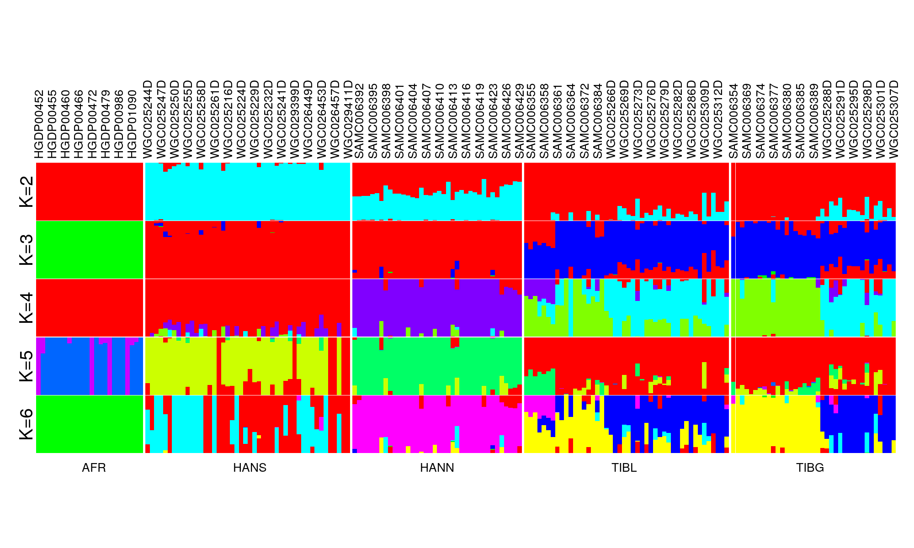