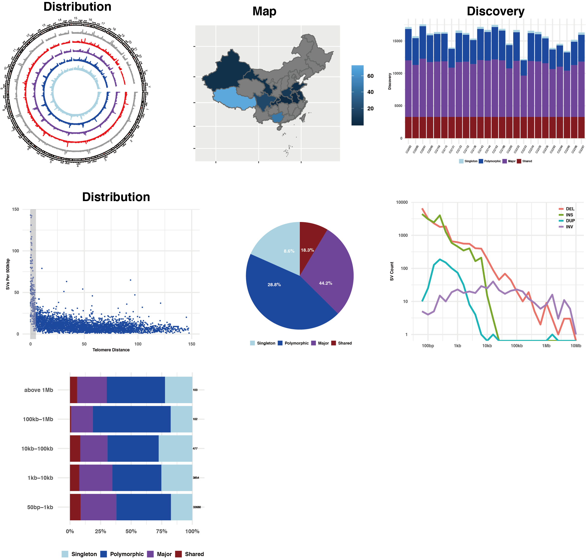

# SV-ONT-Tibetan
This repository includes scripts to analyze structural variations of 25 Chinese samples using nanopore sequencing. 

## Pipeline for Multi-sample SV-calling and annotation.

### Script: pipeline.sv-calling.sh

### Requirements
- [NGMLR](https://github.com/philres/ngmlr)
- [Sniffles](https://github.com/fritzsedlazeck/Sniffles)
- [SVIM](https://github.com/eldariont/svim)
- [NanoSV](https://github.com/mroosmalen/nanosv)
- [SURVIVOR](https://github.com/fritzsedlazeck/SURVIVOR)
- [SVTK](https://github.com/talkowski-lab/svtk)
- [ANNOTSV](https://github.com/lgmgeo/AnnotSV)
- [Paragraph](https://github.com/Illumina/paragraph)
- python3
- numpy

### Summary
In the bash file ```pipeline.sv-calling.sh```, we use sample data to demonstrate the complete process of detecting and annotating structural variations based on nanopore sequencing technology.  

1. Firstly, long reads were mapped to GRCh37 human reference from NCBI without alternate sequences. Mapping was performed with NGMLR with ONT default parameters. 

2. Then SV calling was performed on each sample using Sniffles, NanoSV, and SVIM. These tools have been reported to be compatible with NGMLR and show better accuracy and sensitivity than others. Five minimum supporting reads with at least 50 bp length was required. The insertion sequence and read ID was required for each method, and the rest are all default parameters. 

3. SURVIVOR was used to merge the SVs per each sample, which are supported by at least two methods with a maximum allowed pairwise distance of 1,000 bp between breakpoints. Meanwhile, SVs obtained from different tools are not necessary to agree on the SV-type or the strand, so that we could capture as many potential breakpoints as possible. Finally, we merged the SVs obtained from all the samples as long as one sample supports it. 

4. At last, we need to get a fully genotyped multi-samples dataset. We re-ran Sniffles across all the samples with all these potential regions (--Ivcf) and finally combined SVs with SURVIVOR. This time, we asked SURVIVOR only to report SVs supported by at least one sample, and they have to agree on the SV-type. Furthermore, we used a hard threshold with five minimum supporting reads, and all non-missing genotypes less than this threshold were modified to reference. 

5. After SVs were discovered within a small population using long-read sequencing, we then genotyped these SVs with a relatively large amount of NGS data accumulated in previous studies. Paragraph, which is a new graph-based method, was used to genotype each NGS genome. We set the maximum allowed read count for SVs to 20 times the mean genome coverage for each dataset described above.

6. We annotated SVs for a range of potential effects on coding sequences using SVTK and AnnotSV.


    

## Visualization for chracteristics of SVs

### Script: pipeline.plot.R

### Examples ###

#### SV distribution ####

```
library(circlize)
karyo_plot <- as.data.frame(data_sv_details_all_karyo)
karyo_plot$SUPP <- as.integer(karyo_plot$SUPP)

karyo_plot_BND <- karyo_plot[karyo_plot$SVTYPE=='TRA',]
karyo_plot_BND$seqnames <- paste('chr',karyo_plot_BND$seqnames, sep = '')
karyo_plot_BND_link <- karyo_plot_BND[,c('CHR2','END','END')]
colnames(karyo_plot_BND_link) <- c('seqnames', 'start', 'end')
karyo_plot_BND_link$seqnames <- paste('chr', as.character(karyo_plot_BND_link$seqnames), sep = "")
karyo_plot_BND_link$start <- as.integer(karyo_plot_BND_link$start)
karyo_plot_BND_link$end <- as.integer(karyo_plot_BND_link$end)

array_seqnames <- paste('chr', karyo_plot$seqnames,sep = '')

circos.initializeWithIdeogram(species = 'hg19')

group_shared <- karyo_plot$SUPP==25
group_major <- karyo_plot$SUPP%in%seq(13,24)
group_polymorphic <- karyo_plot$SUPP%in%seq(2,12)
group_singleton <- karyo_plot$SUPP==1

circos.trackHist(factors=array_seqnames, 
               track.height = 0.1,
               x=karyo_plot$start,col = "#999999", border = '#999999', 
               bg.border = NA, bin.size = 500000)
circos.trackHist(factors=array_seqnames[group_shared], 
               track.height = 0.1, 
               x=karyo_plot[group_shared,]$start,col = "red", border = 'red', 
               bg.border = NA,bin.size = 500000)
circos.trackHist(factors=array_seqnames[group_major], track.height = 0.1, x=karyo_plot[group_major,]$start,col = "purple", border = "purple",bg.border = NA,bin.size = 500000)
circos.trackHist(factors=array_seqnames[group_polymorphic], track.height = 0.1, x=karyo_plot[group_polymorphic,]$start,col = "blue",border = "blue",bg.border = NA,bin.size = 500000)
circos.trackHist(factors=array_seqnames[group_singleton], track.height = 0.1, x=karyo_plot[group_singleton,]$start,col = "light blue",border = "light blue",bg.border = NA,bin.size = 500000)

group_shared <- karyo_plot_BND$SUPP==25
group_major <- karyo_plot_BND$SUPP%in%seq(13,24)
group_polymorphic <- karyo_plot_BND$SUPP%in%seq(2,12)
group_singleton <- karyo_plot_BND$SUPP==1

```
#### Sample Distribution for NGS data ####
```
library(maps)
library(mapdata)
library(maptools);
china_map=readShapePoly('china-province-border-data/bou2_4p.shp');
china_map@data$cName <- iconv(china_map@data$NAME, from = "GBK")

x <- china_map@data                          #读取行政信息
xs <- data.frame(x,id=seq(0:924)-1)          #含岛屿共925个形状
china_map1 <- fortify(china_map)             #转化为数据框
china_map_data <- join(china_map1, xs, type = "full", )       #合并两个数据框

tmp <- summary(factor(data_samples_info[data_samples_info$Platform=='NGS',]$cLocation))

NAME <- names(tmp)
pop <- tmp
pop <- data.frame(NAME, pop)
colnames(pop) <- c('cName', 'pop')
china_map_pop <- join(china_map_data, pop, type = "full")

ggplot(china_map_pop, aes(x = long, y = lat, group = group, fill = pop)) +
  geom_polygon() +
  geom_path(color = "grey40") +
  coord_map() +
  xlab('') + 
  ylab("") + 
  theme(legend.title=element_blank(),
        legend.text = element_text(size = 8,face = "bold"),
        axis.text.x = element_blank(),
        axis.text.y = element_blank())
```
#### Sample Distribution for NGS data ####
```
df_sorted <- arrange(data_sample_details_ONT, id, Type) 
df_cumsum <- ddply(df_sorted, "id",
                   transform, 
                   ypos=cumsum(Discovery) - 0.5*Discovery)

ggplot(data=df_cumsum, aes(x=id, y=Discovery, fill = Type)) +
  geom_bar(stat="identity") +
  theme_minimal()+
  theme(legend.title=element_blank(),
        legend.direction = 'horizontal',
        legend.position=c(0.5,0.98),
        legend.spacing.x = unit(0.1, 'cm'),
        legend.key.size=unit(0.3, 'cm'),
        legend.text = element_text(size = 6,face = "bold"),
        axis.text.x = element_text(size = 6,face = "bold", angle = 60, vjust = 0.6),
        axis.text.y = element_text(size = 6,face = "bold"),
        axis.title.y = element_text(size = 6,face = "bold"),
        axis.title.x.bottom = element_text(margin = margin(-15,0,0,0))) +
  scale_fill_manual(values=c('light blue', 'blue', 'purple','dark red')) + 
  xlab("") + 
  ylab("Discovery")
```

#### telomere enrichment ####
```
ggplot(data = data_sv_dist[data_sv_dist$All!=0,],
       aes(x = Dist, y = All)) +
  geom_point(size = 0.05, color="blue") +
  annotate("rect", fill = "dark gray", alpha = 0.5, 
           xmin = 0, xmax = 5,
           ymin = -Inf, ymax = Inf)+
  xlim(0, 150) +
  # ylim(0, 250) +
  ylab('SVs Per 500kbp') +
  xlab('Telomere Distance') +
  theme_minimal()+
  theme(
    axis.text.x = element_text(size = 6,face = "bold"),
    axis.text.y = element_text(size = 6,face = "bold"),
    axis.title.y = element_text(size = 6,face = "bold"),
    axis.title.x = element_text(size = 6,face = "bold"))
```



       
